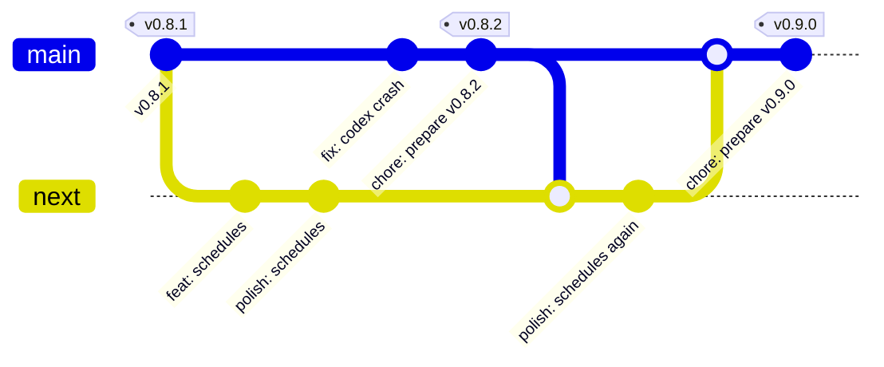

# Contributing to Cadencr

Thanks for your interest in improving Cadencr! This guide covers coding conventions, commit style, and the pull request process.

By participating, you agree to the [Code of Conduct](./.github/CODE_OF_CONDUCT.md). Security issues follow a separate private flow — see [SECURITY.md](./.github/SECURITY.md).

---

## Local Development

Setup (prerequisites, `.env` files, `pnpm dev`) lives in the [README — Run from source](./README.md#run-from-source). Follow that first. The notes below assume your dev environment is running.

## Common Commands

```bash
pnpm dev             # run desktop app + backend service (the usual)
pnpm start           # desktop only (skips the service watcher)
pnpm test            # run all tests (vitest + cargo test)
pnpm run lint        # oxlint + cargo check
pnpm run format      # auto-format (oxfmt + rustfmt)
pnpm run format:check
```

Run a task for a single package:

```bash
pnpm --filter @cadencr/desktop <script>
pnpm --filter @cadencr/service <script>
```

## Rust Build Storage

Cargo targets are intentionally isolated per Git worktree. The main checkout
uses `./target/`; each linked worktree uses its own `<worktree>/target/`.
Repository scripts deliberately do not use `sccache`: it did not produce cache
hits between Cadencr worktrees, while disabling Cargo incremental compilation
and consuming another large machine-wide cache. Cargo's own incremental cache
instead accelerates repeated builds inside each active worktree.

Do not set `CARGO_TARGET_DIR` to `.shared-cargo-target` or another shared path.
Sharing Cargo targets can mix branch artifacts, create lock contention, and
leave large directories behind after worktrees are removed. The repository's
Cargo wrapper overrides inherited `CARGO_TARGET_DIR` values to enforce the
per-worktree policy.

Use the wrapper for targeted Cargo commands:

```bash
pnpm rust -- test -p cadencr-service shared::migrate
pnpm rust -- check -p opencode-sdk-rs
```

The default development and test profiles omit debug information and
incremental state to keep every worktree's Cargo target small. This does not
disable application logs. For a debugger-oriented test run with line tables,
use:

```bash
pnpm rust -- test --profile test-debug -p cadencr-service <test-name>
```

Precompile the Rust targets used by `pnpm dev` without starting the app:

```bash
pnpm dev:precompile
```

For Cadencr-managed worktrees, put this command after `pnpm install` in the
project's worktree setup commands. The setup runs in the new worktree, so its
local `target/` is warm before the first `pnpm dev`.

Inspect and clean storage with dry-run-first commands:

```bash
pnpm rust:storage                         # targets and legacy-path check
pnpm rust:clean                           # preview cleaning the current target
pnpm rust:clean -- --release --apply      # remove current release artifacts
pnpm rust:prune                           # preview non-main targets unused for 14 days
pnpm rust:prune -- --older-than 7d --apply
```

`rust:prune` never cleans the main checkout, the current checkout, or symlinked
targets. Deleted artifacts are safe to rebuild, but applying a
cleanup causes the next Rust command in that worktree to perform a cold build.

Troubleshoot the effective configuration with:

```bash
echo "${CARGO_TARGET_DIR:-<unset>}"
cargo metadata --no-deps --format-version 1 | jq -r .target_directory
pnpm rust:storage
```

---

## Project Conventions

The full ruleset for code style, file/function size limits, and architectural boundaries lives in [`.claude/rules/`](./.claude/rules/). Claude Code loads those files directly (each rule's `paths:` frontmatter scopes it to the files it applies to); for Codex and OpenCode they are mirrored into the auto-generated `## Rules` section of [`AGENTS.md`](./AGENTS.md) by `pnpm build:agents-md`. Read them before opening a PR.

The three rules contributors hit most often:

- Use **pnpm**, not `npm` or `yarn`.
- When the Rust API surface changes, regenerate the frontend API client with `pnpm --filter @cadencr/desktop run generate:api` and commit `packages/desktop/src/api/generated/index.ts`.
- Keep files under **400 lines** and functions under **100 lines**; extract modules before crossing those limits.

---

## Issue and PR Labels

Maintainers keep labels intentionally simple. Contributors do not need to pick every label themselves, but please choose the most specific issue template and fill out the requested fields so maintainers can label quickly.

| Label | Meaning |
|---|---|
| `Feature` | New user-visible capability or improvement |
| `Fix` | Bug fix or regression |
| `Desktop` | Electron/React desktop app |
| `Backend` | Rust service or SDK/backend integration work |
| `provider:claude` | Claude-specific behavior |
| `provider:codex` | Codex-specific behavior |
| `provider:opencode` | OpenCode-specific behavior |
| `Planned` | Accepted and expected to be worked on |
| `Will fix` | Confirmed fix for a bug/regression |
| `Not planned` | Maintainers do not plan to work on this |
| `Duplicated` | Duplicate of another issue or PR |

Provider labels should be used only when the work is truly provider-specific. Generic frontend/backend code should stay provider-neutral.

## Issue Lifecycle

1. Maintainers label the work as `Feature` or `Fix`.
2. Maintainers add `Desktop`, `Backend`, and provider labels when relevant.
3. Accepted work gets `Planned`; confirmed bugs get `Will fix`.
4. Work that will not be pursued gets `Not planned`; duplicates get `Duplicated`.
5. Closing PRs should use GitHub keywords such as `Closes #123` so issues close automatically on merge.

---

## Branching

Cadencr uses two long-lived branches:

| Branch | Meaning | What lands here |
|---|---|---|
| **`next`** | Integration. Everything under active development. | Feature branches, dependency bumps, follow-up polish |
| **`main`** | Releasable. Every commit is a valid release candidate. | Promotions from `next`, urgent fixes, release-prep commits |

Release tags (`vX.Y.Z`) are always cut from `main`. Pushing a tag triggers
[`desktop-release.yml`](./.github/workflows/desktop-release.yml), which notarizes the app, publishes the
GitHub release, and updates the Homebrew cask — so a tag reaches users immediately and its version number
is spent for good.

**Why two branches.** A feature is usually merged before it is polished. When the integration branch is
also the release source, that half-finished feature blocks every unrelated fix from shipping until the
polish is done. Keeping unpolished work on `next` means `main` can be tagged at any moment.



### Day-to-day work

1. Branch from `next`, not `main`. Use short-lived branches named with a scope prefix and a short slug —
   for example `feat/desktop-sidebar-redesign`, `fix/session-runtime-status`, `chore/bump-electron`.
2. Rebase onto the latest `next` before opening a pull request, and target `next` with the PR.
3. Polish, follow-up fixes, and review feedback for that feature also go to `next`.
4. When the feature is genuinely done — tested in the running app, no known rough edges — a maintainer
   promotes `next` into `main`.

```bash
git switch next && git pull
git switch -c feat/my-thing
# …work, then open a PR against next…
```

### Promoting to `main`

Promotion is a maintainer action and always a merge commit, so a release range maps cleanly onto the set
of promotions it contains:

```bash
git switch main && git pull
git merge --no-ff next
git push origin main
```

Promote whole, finished work only. If `next` contains one polished feature and one still in progress,
wait — or land the finished part on `main` directly as its own branch off `main`.

### Urgent fixes while `next` is mid-polish

This is the case the flow exists for. Branch off `main`, merge back into `main`, release, then **merge
`main` down into `next` in the same session**:

```bash
git switch main && git pull
git switch -c fix/urgent-thing
# …fix, test…
git switch main && git merge --no-ff fix/urgent-thing && git push origin main
git switch next && git merge main && git push origin next   # never skip this
```

**The one rule that keeps this cheap:** `main` must never stay ahead of `next`. Every commit that lands on
`main` — a fix, a release-prep commit, a hotfix tag — gets merged down into `next` right away. Skip it once
and the next promotion turns into conflict archaeology.

### Releasing

Releases run from `main` via the `release` skill (`.claude/skills/release/SKILL.md`), which writes the
changelog, bumps versions, runs a security review, verifies `origin/main` is green, and tags. After a
release, merge `main` back into `next` like any other `main` commit.

## Commit Convention

Commits follow **[Conventional Commits](https://www.conventionalcommits.org/)**:

```
<type>(<scope>): <short imperative summary>
```

- **Types**: `feat`, `fix`, `refactor`, `chore`, `docs`, `style`, `test`, `perf`, `build`.
- **Scopes** (optional): package or area — `desktop`, `service`, `session`, `providers`, `landing`, `agent`, etc.
- One logical change per commit. Explain **why**, not just **what**, in the body when the diff is non-obvious.
- Husky runs `pnpm turbo run format:check lint ts-check test knip` as a pre-commit hook. Do not bypass it (`--no-verify`) unless a maintainer asks.

Run `git log --oneline` in this repo for a large set of real examples.

## Pull Request Process

1. **Target `next`.** Contributor PRs are opened against `next`, never against `main` — see [Branching](#branching). Only maintainers push to `main`, for promotions, urgent fixes, and release prep.
2. **Open early.** Draft PRs are welcome for feedback before the work is final.
3. **Use the PR template.** It prompts for summary, motivation, and a test plan.
4. **Keep PRs focused.** A PR should be reviewable in one sitting. Split large changes.
5. **CI must be green** — lint, typecheck, tests, knip, and format checks all pass.
6. **Link the issue.** Use `Closes #123`, `Fixes #123`, or explain why there is no issue.
7. **Show visible changes.** Include screenshots or recordings for UI changes.
8. **Squash on merge.** PRs are squash-merged so `next` stays linear; the squash commit message must itself follow Conventional Commits. Promotions from `next` to `main` are the exception — those are `--no-ff` merge commits.

For a bugfix, include a test that fails without the fix. For a feature, include a test that exercises the new behavior end-to-end when practical.

---

## Notes

- `.env` files under `packages/*/` are local-only and must never be committed. They are covered by `.gitignore`.
- Questions? Open a [discussion](https://github.com/merkr-software/cadencr/discussions) or a draft issue.
