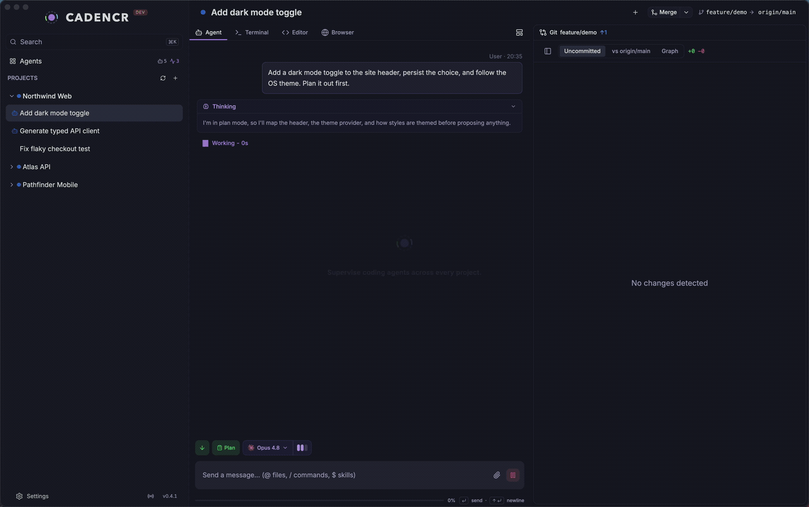

<p align="center">
  <a href="https://cadencr.com">
    
  </a>
</p>

<p align="center">
  <a href="https://cadencr.com"><strong>▶ Watch the full demo at cadencr.com</strong></a>
</p>

<h1 align="center">CadencR</h1>

<p align="center">
  <strong>Stop switching. One window for Agent, Git, Browser, Editor &amp; Terminal.</strong><br />
  The IDE for the era of agents — read, steer, and ship with Claude Code, OpenCode, and Codex.
</p>

<p align="center">
  <a href="https://cadencr.com">Website</a>
  ·
  <a href="https://cadencr.com/docs/">Docs</a>
  ·
  <a href="https://cadencr.com/news/">News</a>
  ·
  <a href="https://github.com/merkr-software/CadencR/releases">Download</a>
</p>

<p align="center">
  <sub>Open source · No telemetry · Apache 2.0 · macOS</sub>
</p>

---

## Stop babysitting agents in a terminal scrollback

CLI coding agents are powerful, but the workflow around them is still too often a pile of terminals, branches, diffs, and half-remembered context — with you alt-tabbing between windows all day.

CadencR turns local coding agents into a desktop IDE experience: every task gets a focused workspace with its own agent session, Git worktree, editor, terminal, embedded browser, approvals, and review flow.

You keep the agents you already use. CadencR gives you the surface to supervise them — every running agent, every project, every tab in one place — without losing the thread.

## What you get

| Instead of... | CadencR gives you... |
| --- | --- |
| One terminal per agent | A unified cockpit for Claude Code, OpenCode, and Codex sessions across every project. |
| Agents fighting in the same checkout | Isolated feature workspaces, each backed by its own Git worktree and branch. |
| Endless tool-call scrollback | Rendered streams with grouped tool-call pills, inline diffs, model tags, and a context meter. |
| Jumping between editor, terminal, and a Git UI | Files, diffs, terminal, an embedded browser, and commits in one place. |
| A separate window to check the app | A real Chromium pane your agent can drive to QA its own change. |
| Guessing what changed | A review-first flow built around diffs, commit previews, and human checkpoints. |

## One window, every surface

### Agent cockpit

A unified grid of every agent session across your projects. Filter with a small query language — `/last:5m`, `/project:`, `/sort:` — pin the sessions that matter, and navigate the rest by keyboard. Live status rings show who's running, idle, waiting, or errored before you open anything.

### A readable stream

CadencR reinterprets raw agent output as it arrives: tool calls collapse into pills (Bash, Grep, Read, Edit, Thinking — click to expand), file writes render as themed inline diffs with `+/-` gutters, each message is tagged with the model that produced it, and a context meter tracks the window filling. Same agent, same commands, orders of magnitude more legible.

### Git, where you can see it

Agents land commits — they don't edit in place. Review the staged diff and the pending message *before* anything ships, browse a commit graph across sessions and branches, and commit (`⌘⇧K`), push (`⌘⇧U`), or open a compare/PR (`⌘⇧O`) without a terminal detour.

### A real editor, not a viewer

A CodeMirror editor with LSP navigation — go-to-definition, references, symbols, diagnostics, and rename wherever a language server is available — plus file and content search, split panes, Git gutter markers, blame, Markdown preview, and a read-only large-file mode so opening a huge file never freezes the app.

### A real terminal, next to the agent

One `xterm.js` PTY per session, rooted at that session's worktree, for the things the agent shouldn't do — ssh, dev servers, ad-hoc scripts. Split the pane freely; a warning flags if the shell drifts out of the worktree.

### An embedded browser your agent can drive

A real Chromium pane with tabs scoped per feature. Point it at your dev server and watch changes land — or let the agent drive it over MCP: it opens the page it just changed, clicks through the flow, screenshots, and reads the console and failed network requests *before* telling you it's done.

## Built for how agents actually work

- **Run agents in parallel.** Start several features, fixes, or investigations at once. Each session works on its own branch in its own Git worktree, so one agent can run tests while another explores a bug or prepares a refactor — no fighting over the same checkout.
- **Approvals & permissions.** Plan approvals, tool-permission cards showing the exact command, and multi-choice questions become explicit keyboard checkpoints. Per-provider permission modes — from ask-every-time to auto-accept edits to opt-in bypass/full-access — cycle with `Shift+Tab`.
- **Custom actions.** Attach reusable shell commands to a project — lint, deploy, seed a database — with `${VARIABLE}` placeholders. Run them on demand from the `+` menu or on a fixed schedule against any feature's worktree.
- **Steer from a second screen.** Pair a phone, tablet, or second computer by QR code or link and drive the same sessions, terminals, and editor from a browser. Local-first (agents and state stay on your machine), works over your LAN or Tailscale, installs as a PWA, and can send Web Push notifications.
- **Agents that orchestrate agents.** CadencR ships its own MCP servers — Browser, Project, and Workspace — so an agent can inspect the running browser, compare and spawn sibling sessions in the project, and search conversation history across your whole workspace.
- **Works with the agents you run.** CadencR supports Claude Code, OpenCode, and Codex, surfacing each through the same shared workflows instead of hardcoded, per-provider assumptions — so switching between them doesn't mean relearning the app.

## Install

### macOS

CadencR currently ships a desktop build for **macOS on both Apple Silicon and Intel**. Native Linux and Windows builds are planned next; you can [run from source](#run-from-source) on either today.

Install with [Homebrew](https://brew.sh):

```bash
brew install --cask merkr-software/cadencr/cadencr
```

Or download the latest DMG/ZIP from [GitHub Releases](https://github.com/merkr-software/CadencR/releases).

> CadencR is early `0.x` software. Expect fast iteration, frequent updates, and a few sharp edges.

### Run from source

Use this path if you want to try the latest code or contribute.

On Linux, follow the [Linux development setup](./docs/LINUX_SETUP.md).

On Windows, use WSL2/WSLg and follow the [Windows / WSL development setup](./docs/WINDOWS_WSL_SETUP.md).

#### Requirements

- **Node.js 22.x** — the repo enforces `>=22.18.0 <23.0.0`.
- **pnpm** — managed through Corepack.
- **Rust** — install with [rustup](https://rustup.rs/).
- **cargo-watch** — required by `pnpm dev` for the Rust service watcher. Install with `cargo install cargo-watch`.
- At least one local agent CLI you want to use: Claude Code, OpenCode, or Codex.

#### Setup

```bash
git clone https://github.com/merkr-software/CadencR.git
cd CadencR

corepack enable
pnpm install

cp packages/service/.env.example packages/service/.env
cp packages/desktop/.env.example packages/desktop/.env
```

Set the same local token in both env files:

- `CADENCR_AUTH_TOKEN` in `packages/service/.env`
- `VITE_API_TOKEN` in `packages/desktop/.env`

Then start the app:

```bash
pnpm dev
```

## Development

```bash
pnpm build                              # build the desktop app
pnpm test                               # Vitest + Rust tests
pnpm lint                               # oxlint
pnpm format                             # oxfmt + cargo fmt
pnpm --filter @cadencr/desktop ts-check # TypeScript checks
pnpm --filter @cadencr/desktop knip     # unused export detection
```

Rust build artifacts are isolated in each checkout's `target/`, where Cargo's
incremental compilation accelerates repeated work. Run `pnpm rust:storage` to
inspect disk use, or see
[CONTRIBUTING.md](./CONTRIBUTING.md#rust-build-storage) for cleanup commands.

## How it works

```text
packages/
├── desktop/                 # Electron shell + React frontend
├── service/                 # Rust API/WebSocket service, packaged as sidecar
├── claude-agent-sdk-rs/     # Claude Code transport SDK
├── codex-app-server-sdk-rs/ # Codex transport SDK
├── opencode-sdk-rs/         # OpenCode transport SDK
├── cli-discovery/           # Local agent CLI discovery
└── landing/                 # Marketing site, docs, and news
```

- **Desktop ↔ Service** — HTTP for requests and WebSocket for live updates.
- **Service ↔ Agents** — provider adapters call local CLIs through focused Rust SDKs.
- **Work isolation** — sessions run in Git worktrees so parallel work stays separated.
- **Local-first** — everything runs on your machine and sends no telemetry; remote access is opt-in over your own LAN or Tailscale.
- **Release flow** — tagged desktop releases build, sign, notarize, and publish macOS artifacts from GitHub Actions.

## Open an issue or contribute

- Found a bug or have a feature idea? [Open an issue](https://github.com/merkr-software/CadencR/issues/new/choose).
- Have a question or want to share what you built? [Start a discussion](https://github.com/merkr-software/CadencR/discussions).
- Want to contribute? Start with [`CONTRIBUTING.md`](./CONTRIBUTING.md).
- Please follow the [Code of Conduct](./.github/CODE_OF_CONDUCT.md).
- Security reports should use [GitHub private vulnerability reporting](https://github.com/merkr-software/CadencR/security/advisories/new).

## License

[Apache 2.0](./LICENSE) — free and open source. Bring your own Claude Code, OpenCode, or Codex credentials.
